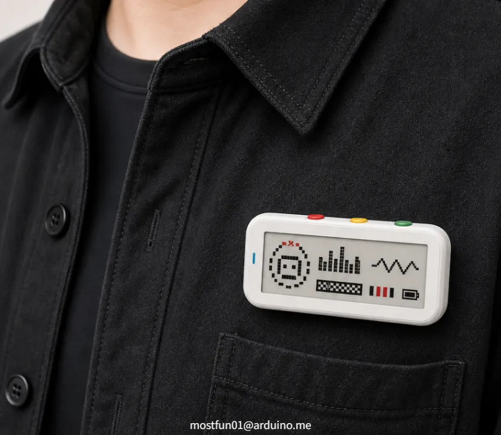
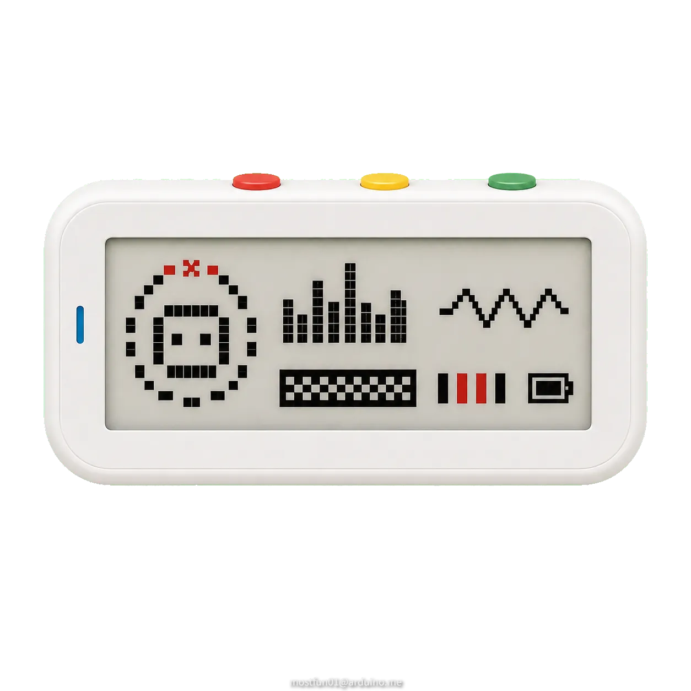
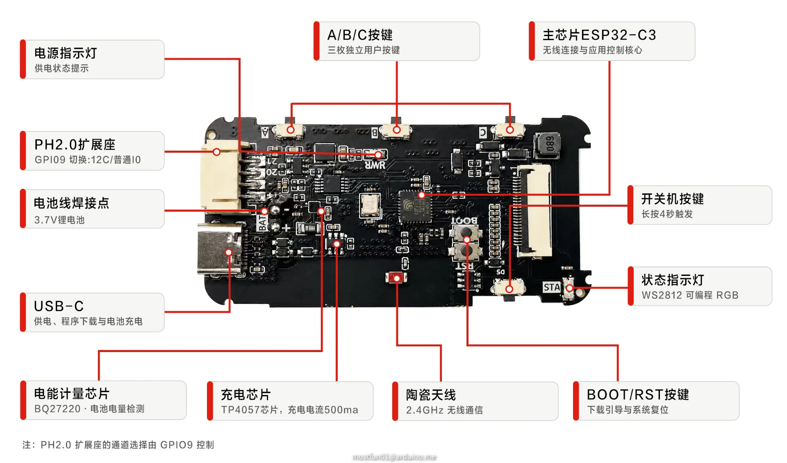
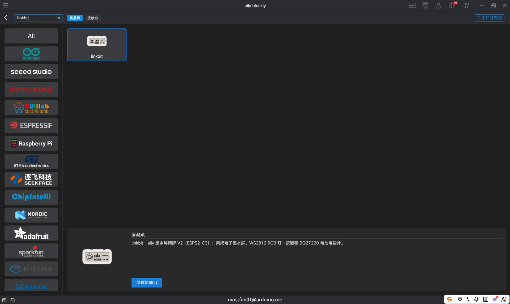
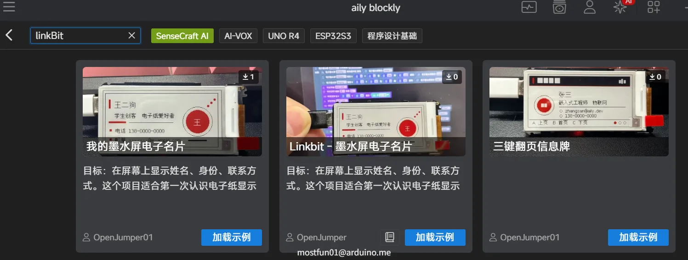
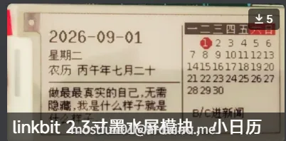
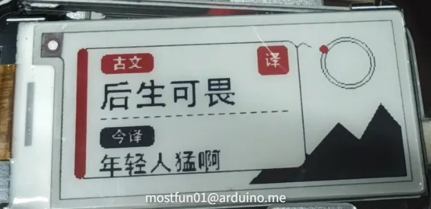

# Linkbit 2.13-inch Programmable E-Paper Badge

中文 | English

## 产品介绍 | Product Introduction

### 1.1 产品介绍 | Overview

Linkbit 是一款面向个人身份展示、活动签到、创客教学与低功耗信息看板应用的可编程墨水屏胸牌。它将 ESP32-C3 主控、2.13 英寸电子墨水屏、三枚交互按键、USB-C 连接、锂电供电与 I2C 扩展接口集成在一块紧凑的开发板中。

Linkbit is a programmable e-paper badge for personal identity display, event check-in, maker education, and low-power information panels. It integrates an ESP32-C3 controller, a 2.13-inch e-paper display, three user buttons, USB-C, lithium-battery power, and an I2C expansion interface on a compact board.

墨水屏在断电后仍能保持画面，非常适合显示姓名、头像、二维码、日程、工牌编号和静态提示信息。配合 AilyBlockly，使用者可通过图形化积木、自然语言辅助与项目示例快速完成自己的胸牌程序。

The e-paper display can keep its image after power is removed, which makes it well suited for names, avatars, QR codes, schedules, badge IDs, and static notices. With AilyBlockly, users can quickly create badge programs using visual blocks, natural-language assistance, and example projects.

定位：Linkbit 是一块可二次开发的电子胸牌主板。屏幕所显示的内容、联网方式与交互逻辑由用户项目决定。

Positioning: Linkbit is a reprogrammable electronic badge main board. The displayed content, networking method, and interaction behavior are defined by the user's project.

### 1.2 核心特点 | Key Features

- 2.13 英寸电子纸显示：122 x 250 像素，竖屏阅读比例适合胸牌和信息卡。  
  2.13-inch e-paper display: 122 x 250 pixels, with a portrait aspect ratio suitable for badges and information cards.
- ESP32-C3 主控：支持无线连接与可编程交互，为动态更新与个性化展示留出空间。  
  ESP32-C3 controller: supports wireless connectivity and programmable interaction for dynamic updates and personalized display.
- 低功耗画面保持：电子纸刷新后无需持续供电维持画面，适合长时间展示静态内容。  
  Low-power image retention: after refresh, the e-paper panel does not need continuous power to keep the image.
- 三键交互：A、B、C 三个独立按键，可用于切换页面、翻阅日程或触发自定义动作。  
  Three-button interaction: independent A, B, and C buttons can switch pages, browse schedules, or trigger custom actions.
- USB-C 与锂电供电：支持开发下载、充电及便携使用；板载电量检测芯片便于设计续航提示。  
  USB-C and lithium-battery power: supports programming, charging, and portable use; the onboard fuel-gauge chip helps implement battery indicators.
- I2C 扩展与状态灯：预留 3.3 V I2C 接口，并集成一颗可编程 WS2812 状态灯。  
  I2C expansion and status LED: exposes a 3.3 V I2C interface and includes a programmable WS2812 status LED.

### 1.3 AilyBlockly 软件开发体验 | AilyBlockly Development Experience

AilyBlockly 是面向硬件开发的 AI 辅助图形化 IDE。Linkbit 的开发板配置已收录在 AilyBlockly 开发板仓库中，软件侧可按项目管理板卡、编译工具链和常用库。

AilyBlockly is an AI-assisted visual IDE for hardware development. Linkbit board support is included in the AilyBlockly board repository, so the software can manage the board, toolchain, and common libraries by project.

- 从积木搭建开始：用显示、按键、网络等模块组织项目逻辑。  
  Start from blocks: build project logic with display, button, network, and other modules.
- 从自然语言获得帮助：可将“做一个可翻页的电子名片”这类需求交给 AI 辅助拆解。  
  Get help from natural language: requests such as "make a paged electronic business card" can be decomposed with AI assistance.
- 从项目广场学习：导入配套示例，先运行、再修改，降低第一次接触墨水屏的门槛。  
  Learn from the project gallery: import matching examples, run them first, then modify them to reduce the learning curve.
- 遇到编译或上传问题时：保留报错信息和串口输出，交给软件内的调试能力或社区协助分析。  
  When compilation or upload fails: keep the error message and serial output for the IDE debugging tools or community support.

## 2 参数 | Specifications

### 2.1 参数说明 | Specification Table

| 类别 / Category | 项目 / Item | 说明 / Description |
| --- | --- | --- |
| 主控 / MCU | ESP32-C3 | Linkbit 主控芯片；适合无线连接与交互应用。 / Main controller for wireless and interactive applications. |
| 显示屏 / Display | 2.13 英寸 Active Matrix EPD | 竖向电子纸显示，分辨率 122(H) x 250(V) Pixel。 / Portrait e-paper display, 122(H) x 250(V) pixels. |
| 显示区域 / Active Area | 23.7046 x 48.55 mm | 屏幕有效显示区域。 / Effective display area. |
| 面板尺寸 / Panel Size | 30(H) x 71.2(V) x 2.35(D) mm | 电子纸面板尺寸，不等同于整机尺寸。 / E-paper panel size, not the full device size. |
| PCBA 尺寸 / PCBA Size | TBD | 原文档中该项留空。 / The original document leaves this item blank. |
| 像素间距 / Pixel Pitch | 0.1943 x 0.1942 mm | 以屏幕参数表为准。 / Refer to the panel datasheet. |
| 显示控制器 / Display Controller | SSD1680Z | 原理图屏幕驱动接口标注兼容 SSD1680Z / JD79661。 / Schematic notes compatibility with SSD1680Z / JD79661. |
| 显示接口 / Display Interface | 3-/4-wire SPI | 主板采用 SPI 信号连接电子纸。 / The board connects to the e-paper panel through SPI. |
| 显示颜色 / Colors | 黑白 / 黑白红 / Black-white / Black-white-red | 三色型号仅支持全屏刷新。 / The tri-color version supports full refresh only. |
| 屏幕工作电压 / Panel Voltage | 2.2 - 3.7 V | 为电子纸面板参数。 / E-paper panel parameter. |
| 视角 / Viewing Angle | 全视角 / Full viewing angle | 以屏幕参数表为准。 / Refer to the panel datasheet. |
| 环境温度 / Temperature | 工作 0 - 50 C；存储 -25 - 70 C / Operating 0 - 50 C; storage -25 - 70 C | 为电子纸面板参数。 / E-paper panel parameter. |
| 用户输入 / User Input | A / B / C 三键 / A / B / C buttons | 板载独立按键。 / Onboard independent buttons. |
| 扩展 / Expansion | 4Pin I2C (3.3 V) | GND、SCL、SDA、3.3 V；用于外接低速传感器或模块。 / GND, SCL, SDA, 3.3 V for low-speed sensors or modules. |
| 状态指示 / Status Indicator | 1 x WS2812 | 数据输入连接 GPIO4。 / Data input connected to GPIO4. |
| 供电 / Power | USB-C / 单节 3.7 V 锂电池 / USB-C / single-cell 3.7 V lithium battery | 板载充电、电量检测与三秒开机电路。 / Onboard charging, fuel gauge, and three-second power-on circuit. |
| 屏幕选型说明 / Display Selection Note | 示例默认按三色屏编写 / Examples default to tri-color display behavior | 程序中的刷新方式改为全屏刷新，更长的刷新等待时间。 / Use full-screen refresh and longer refresh waits in the program. |

### 2.2 引脚及接口说明 | Pinmap and Interfaces

| 资源 / Resource | GPIO / 端口 / Port | 说明 / Description |
| --- | --- | --- |
| 墨水屏 / E-paper | GPIO0 / 1 / 2 / 3 / 6 / 7 | BUSY / RST / CS / DC / CLK / DIN，已被屏幕占用。 / Used by the display. |
| 按键 / Buttons | GPIO10 / GPIO5 / GPIO8 | 依次为 A / B / C；按下时接地，建议使用上拉输入。 / A / B / C respectively; pulled to ground when pressed, use pull-up input. |
| RGB 状态灯 / RGB Status LED | GPIO4 | WS2812 DIN。 / WS2812 data input. |
| BOOT | GPIO9 | 下载引导按键；同时控制 I2C 通道切换，请勿作为普通按键使用。 / Download boot button and I2C channel-switch control; do not use as a normal button. |
| I2C 扩展 / I2C Expansion | GPIO21(SCL) / GPIO20(SDA) | 经模拟开关连接 CN2；GPIO9 为低时通向扩展接口。 / Routed to CN2 through an analog switch; GPIO9 low selects the expansion interface. |
| USB | GPIO18(D-) / GPIO19(D+) | ESP32-C3 原生 USB 数据线。 / Native ESP32-C3 USB data lines. |
| 复位 / Reset | CHIP_EN | 板载复位键，不分配普通 GPIO。 / Onboard reset; not a general-purpose GPIO. |

## 3 快速上手教程 | Quick Start

### 准备工作 | Preparation

- 一块 Linkbit 墨水屏胸牌。  
  One Linkbit e-paper badge.
- 一条支持数据传输的 USB-C 线（仅充电线无法上传程序）。  
  A USB-C cable that supports data transfer. Charge-only cables cannot upload programs.
- 电脑已连接网络；首次使用会下载板卡包与编译工具。  
  A computer with network access. First use may download board packages and compiler tools.
- 已安装 AilyBlockly。  
  AilyBlockly installed.

### 软件的下载安装 | Download and Install Software

访问 AilyBlockly 官方下载页，下载适用于当前操作系统的安装包；安装完成后启动软件。首次启动时按提示完成基础设置，并保持网络连接，以便软件获取需要的资源包。

Visit the official AilyBlockly download page, download the installer for your operating system, and launch the software after installation. On first launch, complete the initial setup and keep the computer online so the software can fetch required resource packages.

使用 USB-C 数据线连接 Linkbit。若系统未识别设备，请先更换数据线或 USB 端口，再检查设备管理器。

Connect Linkbit with a USB-C data cable. If the system does not detect the device, try another data cable or USB port first, then check Device Manager.

下载地址：中国版下载与用户文档入口可从 AilyBlockly 项目主页进入：https://yiyu.pro/ 。

Download address: the China download and user-documentation entry can be found from the AilyBlockly project page: https://yiyu.pro/ .

该主控板主要搭配 AilyBlockly 实现编程，也能兼容 Arduino 生态中的多种传感器，实现互动项目开发。

This board is mainly programmed with AilyBlockly and can also work with many sensors in the Arduino ecosystem for interactive projects.

安装及使用 AilyBlockly：软件免费。若使用内置 AI 自然语言编程功能，可以填写邀请码 `OPENJUMPER`，可免费获得一个月 AI 服务。

AilyBlockly installation and use: the software is free. If you use the built-in AI natural-language programming feature, invitation code `OPENJUMPER` may provide one free month of AI service.

Video tutorial: [AilyBlockly software installation tutorial](https://www.bilibili.com/video/BV1f68w6UEcs/?spm_id_from=333.337.search-card.all.click)

### 选择板卡，新建项目 | Select Board and Create a Project

在欢迎页或项目菜单中创建新项目。在开发板列表中搜索并选择“Linkbit”。若列表暂未显示，请在软件内更新开发板资源后重试。

Create a new project from the welcome page or project menu. Search for and select "Linkbit" in the board list. If it does not appear yet, update board resources in the software and try again.

为项目命名，例如“我的电子名片”；在库管理或组件列表中添加配套的电子纸显示库。先建立最小可运行程序：初始化电子纸、清屏、显示一行文字，然后执行全屏刷新。保存项目。首次编译可能较慢，等待工具链安装完成即可。

Name the project, for example "My Electronic Business Card"; add the matching e-paper display library from the library manager or component list. Start with a minimal runnable program: initialize the e-paper display, clear the screen, display one line of text, and then perform a full refresh. Save the project. The first compilation may take longer while the toolchain is installed.

### 项目广场搜索配套项目，编译上传 | Find Matching Projects, Compile, and Upload

打开“项目广场”，搜索“Linkbit”或“墨水屏胸牌”。优先选择带有 Linkbit 标识的配套项目。

Open the project gallery and search for "Linkbit" or "e-paper badge". Prefer examples marked for Linkbit.

建议先导入“Linkbit - 墨水屏电子名片”示例；若广场项目名称调整，可用“电子名片”关键词继续检索。打开项目后再次确认目标板卡为 Linkbit，检查 USB 设备已连接。点击“编译并上传”。上传过程中不要拔掉数据线，也不要切断电源。等待电子纸完成刷新。显示画面后即表示第一个项目上传成功。

It is recommended to first import the "Linkbit - E-paper Electronic Business Card" example. If the gallery name changes, continue searching with "electronic business card" keywords. After opening the project, confirm that the target board is Linkbit and that the USB device is connected. Click "Compile and Upload". Do not unplug the cable or remove power during upload. Wait for the e-paper display to finish refreshing; when the image appears, the first project has uploaded successfully.

## 4 示例教程 | Example Tutorials

### 示例一：我的墨水屏电子名片 | Example 1: My E-Paper Business Card

目标：在屏幕上显示姓名、身份、联系方式或二维码。这个项目适合第一次认识电子纸显示。

Goal: display a name, identity, contact information, or QR code on the screen. This project is a good first introduction to e-paper display.

| 步骤 / Step | 操作建议 / Suggested Action |
| --- | --- |
| 1. 选择模板 / Select a template | 从项目广场导入“Linkbit - 墨水屏电子名片”配套项目，或基于 3.2 的新项目继续。 / Import the matching "Linkbit - E-paper Electronic Business Card" project from the gallery, or continue from the new project created in section 3.2. |
| 2. 编辑内容 / Edit content | 修改姓名、职位、社群或联系方式；使用清晰、对比度高的黑白图形。 / Edit the name, title, community, or contact details; use clear, high-contrast black-and-white graphics. |
| 3. 处理图片 / Prepare images | 将头像或二维码转换为适合 122 x 250 像素竖屏的黑白图，再导入项目资源。 / Convert avatars or QR codes into black-and-white graphics suitable for a 122 x 250 portrait display, then import them into the project resources. |
| 4. 刷新显示 / Refresh display | 初始化屏幕后绘制文字与图形，最后执行刷新。黑白屏可按库支持情况使用局部刷新。 / Initialize the display, draw text and graphics, then refresh. For black-and-white displays, partial refresh can be used if supported by the library. |
| 5. 上传验证 / Upload and verify | 编译上传，等待画面稳定后检查中文、边距与二维码可读性。 / Compile and upload, then wait for the image to stabilize before checking text, margins, and QR-code readability. |

设计建议：二维码需保留白边；小字号不要过细；电子纸不适合高帧率动画，适合“画面稳定、偶尔更新”的信息展示。

Design tips: keep a white border around QR codes; avoid overly thin small fonts; e-paper is not suitable for high-frame-rate animation, but it is excellent for stable information that updates occasionally.

### 示例二：三键翻页信息牌 | Example 2: Three-Button Paged Information Badge

目标：用 A、B、C 键切换不同页面，例如名片页、今日待办页和签到二维码页。

Goal: use A, B, and C buttons to switch between pages such as a business-card page, today's todo page, and a check-in QR-code page.

1. 建立变量 `page`，用于记录当前页面编号。  
   Create a `page` variable to record the current page number.
2. 设置 A 键切换到上一页，C 键切换到下一页，B 键执行确认或返回首页。  
   Set button A to go to the previous page, C to the next page, and B to confirm or return home.
3. 每次 `page` 变化时，清屏、绘制对应页面，再刷新电子纸。  
   Whenever `page` changes, clear the screen, draw the corresponding page, and refresh the e-paper display.
4. 为避免误触，给按键增加短暂消抖延时，并只在按键事件发生时刷新页面。  
   Add a short debounce delay to avoid accidental triggers, and refresh only when a button event occurs.

### 示例三：电量与状态提示 | Example 3: Battery and Status Indicators

目标：在用户操作或联网更新后，以 WS2812 灯提示工作状态，并在页面角落显示电量图标。

Goal: after user actions or network updates, use the WS2812 LED to indicate working status and display a battery icon in the screen corner.

- WS2812 连接 GPIO4，可将其作为“上传中、连接中、完成、低电量”的状态指示。  
  The WS2812 is connected to GPIO4 and can indicate states such as uploading, connecting, complete, and low battery.
- 板载 BQ27220 电量检测芯片 I2C 地址为 `0x55`；读取前需确保 I2C 通道已切到板载电量检测侧。  
  The onboard BQ27220 fuel-gauge chip uses I2C address `0x55`; before reading it, ensure the I2C channel is switched to the onboard fuel-gauge side.
- 当电量低时，优先减少刷新次数并提示用户充电；不要用频繁全屏刷新作为动画效果。  
  When battery is low, reduce refresh frequency and prompt the user to charge. Do not use frequent full-screen refresh as an animation effect.

注意：GPIO9 同时连接 BOOT 键与 I2C 模拟开关控制端。它是启动相关管脚，涉及电量检测/扩展接口复用时应遵循配套库的初始化方式。

Note: GPIO9 is connected to both the BOOT button and the I2C analog-switch control. It is a boot-related pin, so when using fuel-gauge / expansion-interface multiplexing, follow the initialization method provided by the matching library.

## 5 其他资料 | Additional Resources

### 5.1 配套资料清单 | Resource List

| 资料 / Resource | 用途 / Use | 获取位置 / Location |
| --- | --- | --- |
| 产品原理图 / Product schematic | 了解供电、屏幕、按键与接口连接关系。 / Understand power, display, buttons, and interface connections. | `SCH_aily墨水屏胸牌V2_2026-08-25.pdf` |
| 电池推荐 / Recommended battery | 601443（500 毫安） / 601443, 500 mAh | [Taobao purchase link](https://item.taobao.com/item.htm?_u=pd8q8tv51e9&id=742192891424&spm=a1z09.2.0.0.22852e8dErRNU1) |
| 墨水屏参数表 / E-paper panel datasheet | 确认面板尺寸、显示颜色、工作温度与刷新能力。 / Confirm panel size, display colors, operating temperature, and refresh behavior. | [Baidu Pan download link](https://pan.baidu.com/s/1yq0aR337EDLy3X9_tZWqVg), extraction code `8888` |
| 外壳 3D 打印图纸 / 3D-printable enclosure files | 可以自行打印或者修改外壳设计。 / Print or modify the enclosure. | [Download enclosure files](https://download.openjumper.cn/linkbit%E5%A2%A8%E6%B0%B4%E5%B1%8F%E5%9B%BE%E7%BA%B8/linkbit%E5%A4%96%E5%A3%B3%E5%9B%BE%E7%BA%B8.zip) |
| AilyBlockly | 安装软件、选择 Linkbit、创建或导入项目。 / Install the software, select Linkbit, and create or import projects. | https://yiyu.pro/ |
| 开发板配置仓库 / Board configuration repository | 查看 Linkbit 板卡配置与适配信息。 / View Linkbit board configuration and integration information. | https://github.com/ailyProject/aily-blockly-boards |
| AilyBlockly 项目主页 / AilyBlockly project page | 下载、用户文档、项目广场与问题反馈入口。 / Downloads, user documentation, project gallery, and issue feedback. | https://github.com/ailyProject/aily-blockly |

### 5.2 使用注意事项 | Notes and Safety

- 使用前确认电池极性与额定电压。Linkbit 面向单节 3.7 V 锂电池应用；不要直接接入高于设计范围的电源。  
  Confirm battery polarity and rated voltage before use. Linkbit is designed for a single-cell 3.7 V lithium battery; do not connect a power source above the designed range.
- 电子纸刷新期间不要断电。黑白屏、三色屏和四色屏的刷新能力不同，请按实际屏幕型号选择刷新模式。  
  Do not remove power while the e-paper display is refreshing. Black-white, tri-color, and four-color panels have different refresh behavior; choose the refresh mode according to the actual panel.
- I2C 扩展接口为 3.3 V 逻辑电平，不可直接接入 5 V 信号。  
  The I2C expansion interface uses 3.3 V logic and must not be directly connected to 5 V signals.
- GPIO0-3、6、7 已由墨水屏使用；GPIO9 为启动及 I2C 通道选择用途；这些资源不建议重复占用。  
  GPIO0-3 and GPIO6-7 are used by the e-paper display; GPIO9 is used for boot and I2C channel selection. These resources are not recommended for reuse.
- 产品处于打样和持续完善阶段，若用于批量产品，请完成屏幕刷新、续航、充电温升、无线性能和整机可靠性测试。  
  The product is in prototyping and continuous improvement. For mass production, complete tests for display refresh, battery life, charging temperature rise, wireless performance, and overall reliability.

Linkbit · 让每一块胸牌，都成为可表达的小屏幕。  
Linkbit: let every badge become a small screen that can express.

## Project Gallery Examples | 项目广场示例

| 用户名 / User | 项目名称（广场）/ Project name | 功能描述 / Description |
| --- | --- | --- |
| linx_mushroom | linkbit 2.3 寸墨水屏模块，小日历 | 基于 2.13 寸墨水屏的 WiFi 万年历热搜屏：联网定时拉取日历、每日语录和百度热搜，按键切换日历页与热搜页并支持滚动浏览。 / A WiFi calendar and trending-search display based on the 2.13-inch e-paper screen: periodically fetches calendar data, daily quotes, and Baidu hot-search items, with buttons for switching between calendar and trending pages and scrolling. |
| vonweller | 在线同步手绘 TODOLIST | 配套设计了网页，可以通过网页写字并同步到屏幕中的 todo list 显示。需要输入 WiFi 热点和密码后下载程序联网。 / A paired web page lets users write by hand online and sync the result to the screen as a todo list. Enter WiFi SSID and password before downloading the network-enabled program. |
| 小车骑起来，夸大丶夸大丶夸大 | Linkbit 古文今译 | 将晦涩难懂的古文字自动描述成通俗易懂白话文，每天定时同步更新。 / Automatically rewrites difficult classical Chinese into easy-to-understand modern Chinese and updates on a schedule. |

## Source | 来源

This README was prepared from the Linkbit documentation page on Arduino 中文社区 and translated into a bilingual format for easier access by international customers.

本文档根据 Arduino 中文社区上的 Linkbit 文档整理，并改写为中英双语格式，方便海外客户无需登录中文论坛即可查看。

